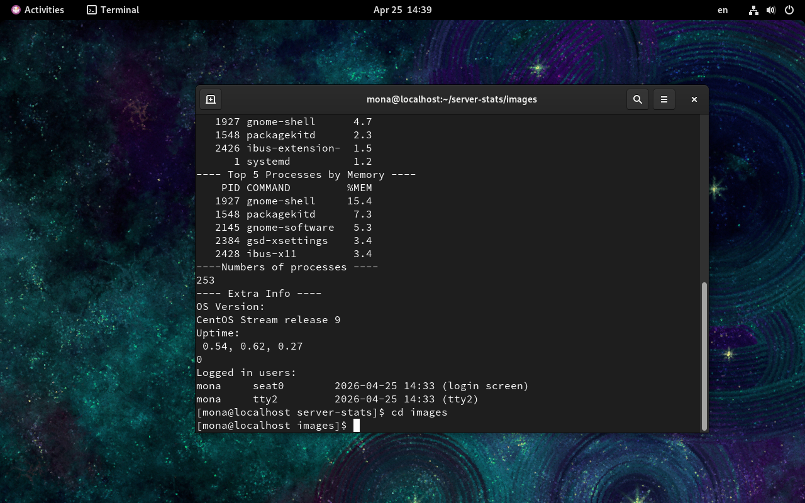
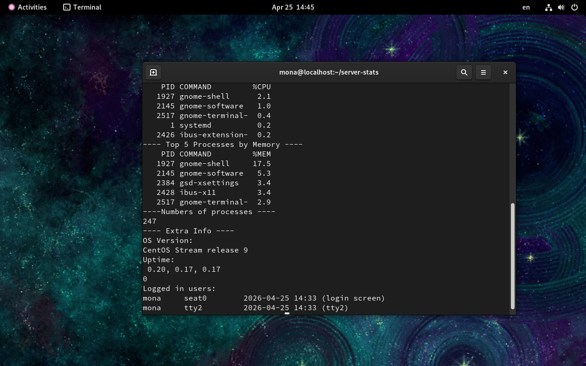

# 🖥️ Server Performance Stats Script

## 📌 Description
A simple Bash script to analyze Linux server performance.

It provides quick insights into:
- CPU usage
- Memory usage
- Disk usage
- Top processes

---

## ⚙️ Features
- ✅ Total CPU usage
- ✅ Memory usage (Used / Free / %)
- ✅ Disk usage
- ✅ Top 5 processes by CPU
- ✅ Top 5 processes by Memory
- ✅ System info (Uptime, OS, users)

---

## 📸 Screenshot

---
## Project Demo

Project URL https://roadmap.sh/projects/server-stats

Project Demo https://github.com/monaismail7/DevOps-Projects

How to Run
chmod +x server-stats.sh
./server-stats.sh
